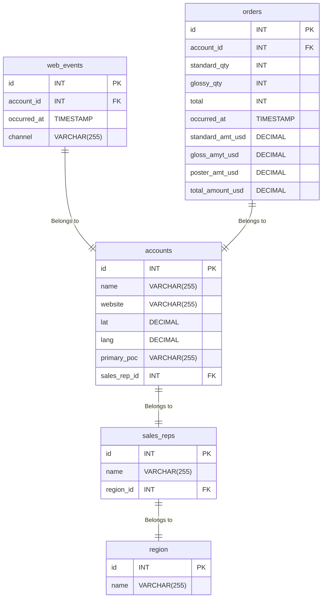

# Programming for Data Science

The purpose of this repo is to capture the projects associated with the Udacity Nanodegree "Programming for Data Science with Python".

## Table of Contents

- [Programming for Data Science](#programming-for-data-science)
  - [Table of Contents](#table-of-contents)
  - [Lessons](#lessons)
    - [Introduction to SQL](#introduction-to-sql)
      - [Articles](#articles)
      - [SQL Queries](#sql-queries)
      - [Course Recap](#course-recap)
      - [SQL Table Data](#sql-table-data)
      - [Parch and Posey Entity Relationship Diagram](#parch-and-posey-entity-relationship-diagram)
    - [Introduction to Python Programming](#introduction-to-python-programming)
      - [Python Basics](#python-basics)
      - [Python Data Structures](#python-data-structures)
      - [Python Functions](#python-functions)
    - [Introduction to Version Control](#introduction-to-version-control)
      - [Git Basics](#git-basics)
      - [Git Branching](#git-branching)
      - [Git Collaboration](#git-collaboration)
    - [Introduction to the Command Line](#introduction-to-the-command-line)
      - [Command Line Basics](#command-line-basics)
      - [Advanced Command Line](#advanced-command-line)
  - [Environment.yml](#environmentyml)

## Lessons

### Introduction to SQL

#### Articles
These are articles associated with SQL

#### SQL Queries

This folder holds a collection of SQL queries used during the course. Due to the Server and Database not being accessible on this repo, they are for reference only. The server and data can be recreated utilizing the data stored in this repository. The data is located in *./sql_table_data/parch-and-posey.sql*. Input this SQL query into your application and run it to create the database and tables.

#### Course Recap
This holds a set of Keywords and examples for SQL 

#### SQL Table Data

This data was used to create the Database and Tables used for this repository. For this repository, I utilized pgAdmin4 with Postgre SQL.

**Install PostgreSQL and pgAdmin**

*Install PostgreSQL*

```bash
sudo apt update
sudo apt install postgresql postgresql-contrib -y
```

*Enable and start PostgreSQL:*

```bash
sudo systemctl enable postgresql
sudo systemctl start postgresql
```

*Verify PostgreSQL is running:*

```bash
sudo systemctl status postgresql
```

**Install pgAdmin4**

*Option 1: Install via APT (Recommended)*

```bash
curl -fsSLo /usr/share/keyrings/pgadmin-keyring.asc https://www.pgadmin.org/static/packages_pgadmin_org.pub
echo "deb [signed-by=/usr/share/keyrings/pgadmin-keyring.asc] https://ftp.postgresql.org/pub/pgadmin/pgadmin4/apt/$(lsb_release -cs) pgadmin4 main" | sudo tee /etc/apt/sources.list.d/pgadmin4.list
sudo apt update
sudo apt install pgadmin4 -y
```

*Option 2: Install via Snap (if APT fails)*

```bash
sudo snap install pgadmin4
```

**Configure pgAdmin4**

*Desktop Version*

```bash
pgadmin4
```

*Web Version*

```bash
sudo /usr/pgadmin4/bin/setup-web.sh
```

Then, open http://localhost/pgadmin4 in your browser.

**Register PostgreSQL Server in pgAdmin4**

1. Open pgAdmin4
2. Click "**Register Server**"
3. In the **General** tab:
    - **Name**: PostgreSQL (local)
4. In the **Connection** tab:
    - **Host:** localhost
    - **Port:** 5432
    - **Username:** your username
    - **Password:** your password
5. Click **Save**

#### Parch and Posey Entity Relationship Diagram



### Introduction to Python Programming

#### Python Basics

This section covers the basics of Python programming, including variables, data types, and basic operations.

#### Python Data Structures

This section covers Python data structures such as lists, tuples, dictionaries, and sets.

#### Python Functions

This section covers defining and using functions in Python, including lambda functions and higher-order functions.

### Introduction to Version Control

#### Git Basics

This section covers the basics of Git, including initializing a repository, committing changes, and viewing the commit history.

#### Git Branching

This section covers creating and managing branches in Git, including merging branches and resolving conflicts.

#### Git Collaboration

This section covers collaborating with others using Git, including cloning repositories, pushing changes, and creating pull requests.

### Introduction to the Command Line

#### Command Line Basics

This section covers the basics of using the command line, including navigating the file system and managing files and directories.

#### Advanced Command Line

This section covers advanced command line topics such as scripting and automation.

## Environment.yml

To create the conda environment from the `environment.yml` file, use the following command:

```bash
conda env create -f environment.yml
```

This will create a new conda environment with all the dependencies specified in the `environment.yml` file. To activate the environment, use:

```bash
conda activate <environment_name>
```

Replace `<environment_name>` with the name of the environment specified in the `environment.yml` file.

