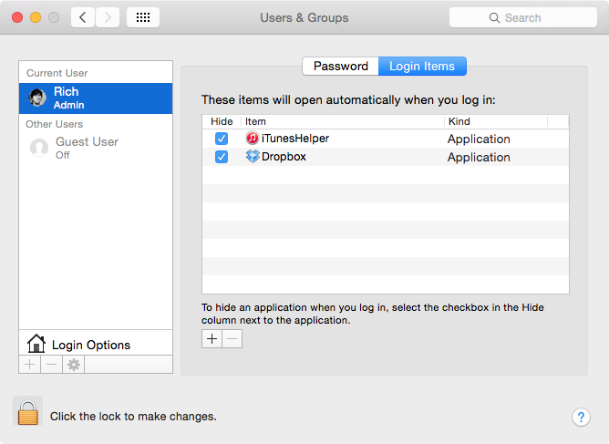
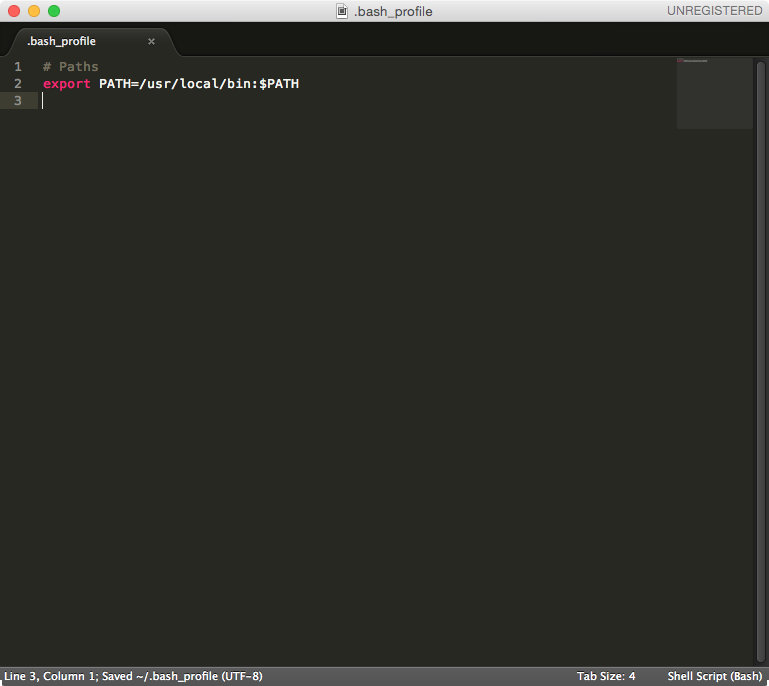

# Bash Profile

You’ve probably noticed that when you turn on your computer, some applications start up with it. Some of them are required by the operating system, and some you might have installed yourself. Some can make your computer’s fan sound like an airplane taking off.

You can see some of these in the “Login Items” tab of the “Users & Groups” section of your System Preferences.



Other applications have their own login items, which run only when that specific application is opened. We’re going to use Bash’s login items feature to make web development easier.

## Why Do I Need a Bash Profile?

The Bash profile is a file on your computer that Bash runs every time a new Bash session is created. This is useful because we need to run certain code every time before starting to work.

macOS doesn’t include a Bash profile by default, but if you already have one, it lives in your home directory with the name `.bash_profile`. And if you did have one, you probably never saw it because its name starts with a period. The Finder hides folders and files starting with a period to protect casual users from harming the operating system—but because you’re a developer now, we’re going to create a Bash profile!

## Creating Your Bash Profile

Open Terminal, copy and paste the following command, and press return.

```bash
$ subl ~/.bash_profile
```

If you received an error, review [Terminal, meet Sublime](https://friendly-101.readthedocs.io/en/latest/commandline.html#terminal-meet-sublime) of the [Command line](https://friendly-101.readthedocs.io/en/latest/commandline.html#command-line) lesson.

The [tilde](https://unix.stackexchange.com/questions/34196/why-was-chosen-to-represent-the-home-directory) (`~`) tells Bash to start traversing the file system from your home directory. In my personal case, an equivalent command would have been `subl /Users/Rich/.bash_profile`, which means `~` is the equivalent of `/Users/Rich`. Using `~` is a shortcut that makes it generic and usable for everybody to understand and use.

Your Bash profile will pop up in a Sublime Text window.

## Understanding Your PATH

The first edit to your Bash profile is to correct your [PATH](https://en.wikipedia.org/wiki/PATH_%28variable%29). `PATH` is an environment variable, which simply means that it represents some small bit of data while you use Terminal. Specifically, `PATH` contains a list of file system paths where the operating system can find programs to run.

When a developer runs a program in Bash, the operating system will sequentially look for the program in each of the paths that `PATH` contains, starting with the first path listed. If the operating system can’t find the program in the first path, it looks for the same program in the second path, and so on, until either eventually finding and running the program or returning an error if the program couldn’t be found.

`PATH` contains paths that are delimited by a colon (`:`). Therefore, the value of `PATH` might look something like:

```bash
/usr/local/bin:/usr/bin:/bin:/usr/sbin:/sbin
```

You can see that `/usr/local/bin` is the first path, and `/usr/bin` is the second path. `/usr/local/bin` is where all programs local to your use of the operating system are located. Storing programs for your personal use in `/usr/local/bin` is a best practice and highly encouraged. Therefore, the `PATH` above is correct.

Likewise, storing programs in `/usr/bin` allows programs to be globally accessible by other users. Storing programs globally can sometimes be desirable, but in general, it’s discouraged and likely to cause confusion.

## Correcting Your PATH

In versions of macOS prior to Yosemite, Apple mistakenly switched the order of the paths, placing `/usr/bin` ahead of `/usr/local/bin`, causing much disruption and angst. Apple has since corrected the issue, but it’s still worth changing because doing so won’t harm the computer and will prevent problems from occurring again.

Copy and paste the following into your Bash profile.

```bash
# Paths
export PATH=/usr/local/bin:$PATH
```

The first line is a comment, which begins with a hash (`#`) and explains the surrounding code. The right portion of the second line begins `/usr/local/bin`, which is the path we want to prioritize, followed by `:`, which joins paths, and finally `$PATH`, which evaluates the value of the existing `PATH`. By appending `$PATH`, we can overwrite the original PATH without destroying its value, making everything nice and tidy!

Next, we assign the value `/usr/local/bin:$PATH` to `PATH` and export it at the same time. Exporting `PATH` ensures that the variable is loaded into memory and accessible.

> **ℹ️ Note:** 
> The difference between `$PATH` and `PATH` is subtle but worth pointing out. 
> When you assign a value to a variable, then the variable should be called without `$`. 
> If you want to evaluate the variable to get its value for use in Bash, prepend `$` to the variable name.



Save and close the file.

## Sourcing Your Bash Profile

We edited our Bash profile, but it is critical to remember the code in the Bash profile runs only when a new Bash session is created, which is called sourcing. Therefore, our changes will take effect when you quit Terminal and open it again to make sure that `PATH` is in fact exported. When Terminal is open again, you can check the value of `PATH` by running the `echo` command:

```bash
$ echo $PATH
```

The output might look like one of the two:

```bash
/usr/local/bin:/usr/bin:/bin:/usr/sbin:/sbin
```

```bash
/usr/local/bin:/usr/local/bin:/usr/bin:/bin:/usr/sbin:/sbin
```

Again, ensure that `/usr/local/bin` is listed prior to `/usr/bin`.

> **ℹ️ Note:**
> Although Terminal allows a Bash profile to be sourced on command without restarting (`source ~/.bash_profile`), the method can be unreliable.

`PATH` is just one environment variable we changed in our Bash profile. There are a lot more, like `USER` for the current user (you!) and `HOME` for the path to the home directory of the current user. We will edit our Bash profile a few more times to run other important code in the future.
