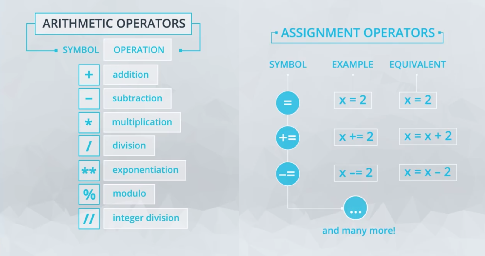
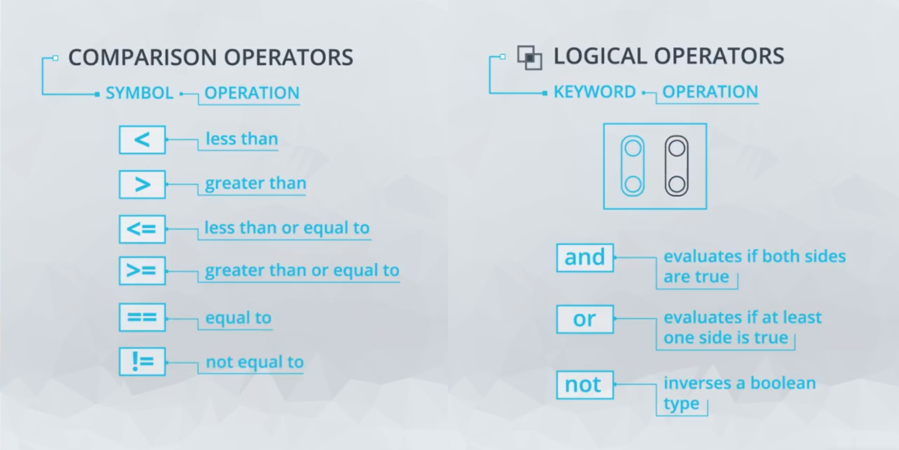

# Data Types and Operators

## Arithmetic Operators



- Arithmetic operators allow mathematical computations in Python.
- Python follows **standard mathematical rules** for operations.

*Arithmetic Operators and Their Functions*
| **Operator** | **Symbol** | **Function** | **Example** |
|:-------------|------------|:-------------|-------------|
| Addition     | `+`        | Adds two numbers | `3 + 5 → 8`|
| Subtraction  | `-` | Subtracts one number from another | `10 - 4 → 6` |
| Multiplication | `*` | Multiplies two numbers | `6 * 2 → 12` |
| Division | `/` | Returns a floating-point result | `7 / 2 → 3.5` |
| Floor Division | `//` | Returns the integer quotient (removes decimal) | `7 // 2 → 3` |
| Modulus | `%` | Returns the remainder after division | `7 % 2 → 1` |
| Exponentiation | `**` | Raises one number to the power of another | `2 ** 3 → 8` |

- Order of Operations follows **PEMDAS**
  - Parentheses
  - Exponents
  - Multiplication and Division (left to right)
  - Addition and Subtraction (left to right)
- Floor division (`//`) is useful when an integer output is necessary
- Modulus (`%`) helps in checking divisibility or cycles (e.g., even/odd checks)

## Variables and Assignment Operators

- **Variables** are used to store data that can be referenced and manipulated in a program.
- Creating a variable in Python is simple. For example:
  ```python
  mv_population = 74728
  ```
  Here, `mv_population` is the variable name, and `74728` is the value assigned to it using the `=` operator.
- The `=` operator is the assignment operator, which assigns the value on the right to the variable on the left.
- Variables can be used to store different types of data, such as integers, floats, strings, etc.
- Using variables instead of raw numbers has many advantages, such as making the code more readable and easier to maintain.

*Example of variable assignment and usage:*
```python
x = 2
y = x
print(y)  # Output: 2
```
- If you try to access a variable that has not been defined, Python will raise a `NameError`.

## Keywords in Python

- **Boolean Values**:
  - `True`
  - `False`

- **Control Flow**:
  - `if`
  - `elif`
  - `else`
  - `for`
  - `while`
  - `break`
  - `continue`
  - `pass`

- **Functions and Classes**:
  - `def`
  - `return`
  - `lambda`
  - `class`

- **Exception Handling**:
  - `try`
  - `except`
  - `finally`
  - `raise`
  - `assert`

- **Variable Scope**:
  - `global`
  - `nonlocal`

- **Logical Operators**:
  - `and`
  - `or`
  - `not`
  - `is`
  - `in`

- **Miscellaneous**:
  - `import`
  - `from`
  - `as`
  - `with`
  - `del`
  - `yield`
  - `async`
  - `await`
  - `None`

- **Assignment Operators** are used to perform operations on variables and assign the result back to the variable.
- Common assignment operators include:
  - `+=` : Increment the variable by a value.
  - `-=` : Decrement the variable by a value.
  - `*=` : Multiply the variable by a value.
  - `/=` : Divide the variable by a value.
  - `//=` : Perform floor division on the variable by a value.
  - `%=` : Take the modulus of the variable by a value.
  - `**=` : Raise the variable to the power of a value.

*Example of assignment operators:*
```python
mv_population = 74128
mv_population += 4000  # Equivalent to mv_population = mv_population + 4000
mv_population -= 600   # Equivalent to mv_population = mv_population - 600
print(mv_population)   # Output: 77528
```
- These operators make the code more concise and easier to read.

## Integers and Floats

- **Integers** are whole numbers without a decimal point. Examples include `1`, `42`, `-7`.
- **Floats** (short for floating-point numbers) are numbers that have a decimal point. Examples include `3.14`, `0.001`, `-2.5`.

*Example of integers and floats:*
```python
a = 5       # Integer
b = 3.14    # Float
```

- When you divide one integer by another, the result is a float.
  ```python
  result = 3 / 4  # result is 0.75, which is a float
  ```

- You can check the type of any object using the `type()` function.
  ```python
  print(type(a))  # Output: <class 'int'>
  print(type(b))  # Output: <class 'float'>
  ```

- To create an integer, provide a whole number without a decimal point.
  ```python
  x = 10  # Integer
  ```

- To create a float, include a decimal point.
  ```python
  y = 10.0  # Float
  ```

- Operations involving an integer and a float will always produce a float.
  ```python
  result = 5 + 2.0  # result is 7.0, which is a float
  ```

- You can convert between integers and floats using the `int()` and `float()` functions.
  ```python
  float_num = float(5)  # Converts integer 5 to float 5.0
  int_num = int(3.14)   # Converts float 3.14 to integer 3 (truncates the decimal part)
  ```

- **Important Note**: Converting a float to an integer will truncate the decimal part, not round it.
  ```python
  print(int(4.9))  # Output: 4
  ```

- Floats are approximations of the numbers they represent, which can lead to small differences in calculations.
  ```python
  print(0.1 + 0.2)  # Output: 0.30000000000000004
  ```

## Whitespace

- In Python, whitespace within a single line of code does not affect how the code works.
  ```python
  print( 3 + 4 )  # This will give the same output as:
  print(3 + 4)
  ```

- However, clear and readable code is critical for collaboration and future maintenance.
- Best practices for code style in Python include:
  - When calling a function, place the opening parenthesis immediately after the function name.
    ```python
    print("Hello")  # Correct
    print ("Hello")  # Incorrect
    ```
  - Avoid extra spaces inside parentheses.
    ```python
    print(3 + 4)  # Correct
    print( 3 + 4 )  # Incorrect
    ```
  - When mixing operators with different priorities, add spaces around the lower priority operators to improve readability.
    ```python
    result = 3 * 4 - 2  # Correct
    result=3*4-2  # Incorrect
    ```
  - Avoid writing extremely long lines of code. Limit lines to 79 or 99 characters.
    ```python
    # If a line is too long, consider breaking it into multiple lines:
    result = (3 * 4 - 2) + (5 / 2)
    ```

- These conventions come from the Python developers guide, specifically PEP 8, which is the style guide for Python code.
- Following standard style guidelines makes code easier to read and consistent among different developers on a team.
- Refer to PEP 8 periodically to ensure your Python style is correct.
- Tools are available to check your code and provide suggestions based on PEP 8 guidelines.

## Booleans, Comparison Operators, and Logical Operators



- **Booleans** are a data type that can hold one of two values: `True` or `False`.
- Booleans are used to represent truth values in logic and are named after George Boole, the founder of Boolean algebra.

*Example of boolean assignment:*
```python
is_sunny = True
is_raining = False
```

- **Comparison Operators** are used to compare two values and return a boolean result.
  
| **Symbol Use Case** | **Boolean** | **Operation** |
|:--------------------|-------------|:--------------|
| 5 < 3               | FALSE       | Less Than     |
| 5 > 3               | TRUE        | Greater Than  |
| 3 <= 3      | TRUE        | Less than or Equal To |
| 3 >= 5   | FALSE       | Greater Than or Equal To |
| 3 == 5              | FALSE       | Equal To      |
| 3 != 5              | TRUE        | Not Equal To  |


*Example of comparison operators:*
```python
print(42 > 43)  # Output: False
print(42 == 42)  # Output: True
```

- **Logical Operators** are used to combine multiple boolean expressions.

| **Logical Use** | **Boolean** | **Operation** |
|:----------------|-------------|---------------|
| 5 < 3 `and` 5 == 5 | FALSE | `and` - Evaluates if all provided statements are true |
| 5 < 3 `or` 5 == 5 | TRUE | `or` - Evaluates if at least one of many statements is True |
| `not` 5 < 3 | TRUE | `not` - Flips the Bool Value |

```python
age = 14
is_teen = age > 12 and age < 20  # True if age is between 13 and 19
print(is_teen)  # Output: True

is_adult = not is_teen  # Inverts the boolean value
print(is_adult)  # Output: False
```

- These operators are essential for controlling the flow of a program and making decisions based on conditions.

## Strings

- **Strings** are used to represent text in Python.
- A string is an immutable ordered series of characters.
- You can create a string by using quotes. Both single (`'`) and double (`"`) quotes work.
  ```python
  greeting = "hello"
  response = 'hi'
  ```

- Strings can include any characters, even spaces, punctuation, and numbers.
  ```python
  sentence = "Hello, world! 123"
  ```

- To include quotation marks within a string, you can use the opposite type of quote to define the string or use a backslash to escape the quotes.
  ```python
  quote = 'She said, "Hello!"'
  escaped_quote = "She said, \"Hello!\""
  ```

- Strings can be concatenated using the `+` operator and repeated using the `*` operator.
  ```python
  full_greeting = greeting + " " + response  # Concatenation
  repeated_greeting = greeting * 3  # Repetition
  ```

- The `len()` function returns the length of a string.
  ```python
  length = len(greeting)  # Output: 5
  ```

- Strings are immutable, meaning their content cannot be changed after they are created. However, you can create new strings based on existing ones.

## Type and Type Conversions

- Up until now, we've discussed four data types in Python: `int`, `float`, `bool`, and `string`.
- You can check the type of any object directly using the built-in function `type()`.
  ```python
  print(type(42))  # Output: <class 'int'>
  print(type(3.14))  # Output: <class 'float'>
  print(type(True))  # Output: <class 'bool'>
  print(type("hello"))  # Output: <class 'str'>
  ```

- Using `type()`, we can observe that the same number can be represented in different types, each with their own set of behaviors.
- Different types have different properties, and when designing a computer program, you'll need to choose the types for your data based on how you're going to use them.
  - For example, if you want to use a number as part of a sentence, it will be easiest if that number is a string.
  - If you want to encode a true-false value, it will be 

    ```python
    # Convert int to string
    house_number = 35
    address = str(house_number) + " Elm Street"
    print(address)  # Output: "35 Elm Street"

    # Convert string to float
    number_str = "35"
    number_float = float(number_str)
    print(number_float)  # Output: 35.0
    ```

- When converting a float to an int, the part of the number after the decimal point is cut off, which means that no rounding occurs.
  ```python
  print(int(4.9))  # Output: 4
  ```

- Converting from int to float adds a decimal zero to the end of the number.
  ```python
  print(float(4))  # Output: 4.0
  ```

## String Methods

- **String Methods** are functions that belong to the string object and perform specific operations on strings.
- Methods are called on an object using the dot notation.

*Example of string methods:*
```python
name = "sebastian thrun"
print(name.title())  # Output: "Sebastian Thrun"
```
- The `title()` method returns a string where the first letter of each word is capitalized.

- Another useful method is `islower()`, which checks if all the characters in the string are lowercase.
  ```python
  print(name.islower())  # Output: True
  ```

- Methods can take arguments. For example, the `count()` method counts the occurrences of a substring in the string.
  ```python
  text = "one fish, two fish, red fish, blue fish"
  print(text.count("fish"))  # Output: 4
  ```

- Methods are similar to functions but are called on objects and can take the object itself as an implicit argument.

## Debugging Code

Everyone gets "bugs," or unexpected errors, in their code, and this is a normal and expected part of software development. We all say at one time or another, "Why isn't this computer doing what I want it to do?!"

So an important part of coding is "debugging" your code, to remove these bugs. This can often take a long time, and cause you frustration, but developing effective coding habits and mental calmness will help you address these issues. With determined persistence, you can prevail over these bugs!

Here are some tips on successful debugging that we'll discuss in more detail below:

- Understand common error messages you might receive and what to do about them.
- Search for your error message, using the Web community.
- Use print statements.


### Understanding Common Error Messages

There are many different error messages that you can receive in Python, and learning how to interpret what they're telling you can be very helpful. Here are some common ones for starters:

**"ZeroDivisionError: division by zero."** This is an error message that you saw earlier in this lesson. What did this error message indicate to us? You can look back in the Quiz: Arithmetic Operators section to review it if needed.

**"SyntaxError: unexpected EOF while parsing"** Take a look at the two lines of code below. Executing these lines produces this syntax error message - do you see why
 
 ```python
greeting = "hello"
print(greeting.upper
```

This message is often produced when you have accidentally left out something, like a parenthesis. The message is saying it has unexpectedly reached the end of file ("EOF") and it still didn't find that right parenthesis. This can easily happen with code syntax involving pairs, like beginning and ending quotes also.

**"TypeError: len() takes exactly one argument (0 given)"** This kind of message could be given for many functions, like len in this case, if I accidentally do not include the required number of arguments when I'm calling a function, as below. This message tells me how many arguments the function requires (one in this case), compared with how many I gave it (0). I meant to use len(chars) to count the number of characters in this long word, but I forgot the argument.

```python
chars = "supercalifragilisticexpialidocious"
len()
```

There are other kinds of error messages that you'll certainly begin experiencing soon in your Python work. Learning what they mean and how to address them will help you debug your code. You might keep an ongoing page of notes on them.

### Search for Your Error Message

Software developers like to share their problems and solutions with each other on the web, so using Google search, or searching in StackOverflow, or searching in Udacity's Knowledge forum are all good ways to get ideas on how to address a particular error message you're getting.

- Copy and paste the error message into your web browser search tab, or in Knowledge(opens in a new tab), and see what others suggest about what might be causing it.
- You can copy and paste the whole error message, with or without quotes around it.
- Or you can search using just key words from the error message or situation you're facing, along with some other helpful words that describe your context, like Python and Mac.

### Use Print Statements to Help Debugging

Adding print statements temporarily into your code can help you see which code lines have been executed before the error occurs, and see the values of any variables that might be important. This approach to debugging can also be helpful even if you're not receiving an error message, but things just aren't working the way you want.
